## Monitor Your Amazon Competitors' Inventory

### Objective

This script will create a spreadsheet of the competiting products that are currently "Out Of Stock" or low in stock, like shown below.


### Why is this useful? 

1. This could be an opportunity to push out competitors and gain market share. To give more context, Amazon is a customer-centric platform. This means sellers on Amazon are expected to offer the best shopping experience for the customer. What's not a great experience? When the product you want is not available. When that happens, Amazon punishes the seller by dropping their product's search ranking. This means instead of being on page 1 of the search pages, it is now on page 4. Sales drop instantly. The few people diligent enough to see your listing won't choose you over the competitor (unless you have something really special to offer). 
2. Knowing when your competitors are/will be out of stock can help you make better restocking and pricing decisions. When you push out a competitor, you will absorb some of their market share (if you're high enough in the search ranking). This means you will sell more than usual, which leads to your inventory depleting sooner. The last thing you want is to stock out yourself. So this will mean preparing reorders sooner and perhaps raising prices to control how quickly you sell. Only raise your price when your inventory levels are close to danger zone, or else you lose potential customers to another competitor.

### Requirements

For this script to work, you must add your competitors' products to your Amazon wishlist. It can be any wishlist, just make sure you set it to "public". This script is unable to web-scrape private wishlists and Amazon searches. 

----------------------------------

### **UPDATE 10/26/2018** -------

Amazon has changed the wishlist formatting, so that the inventory data does not show. As a result, this script can no longer return inventory data.

It is possible to adapt the script to return other pieces of information available through the wishlist page. 

---------------------------------
### The Action Plan

#### Section 1. Observe HTML of wishlist for clues on pattern extraction
#### Section 2. Extracting HTML data
#### Section 3. Organize data using vectors, polish the data (& if possible, systematize the process of data cleaning for reproducible results)
#### Section 4. Store data in spreadsheet

# Section 1. Observe HTML for Patterns

For the purposes of this project, we will be using [this](https://www.amazon.com/hz/wishlist/ls/18UQZ34U5ANT0?&sort=default) public wishlist. See below. 

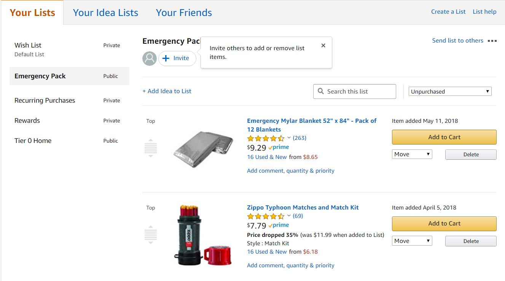

### We Need To:

1. Decide what information to extract
2. Determine how to extract desired information from HTML data

### 1. Deciding What Information To Extract

We observe the webpage, taking note of the information types, such as price, product name, stock status. 

- 14 items, after full loading.
- Stock/availability information shows as "In Stock", "Only X left in stock--order soon", "Out Of Stock", "Usually ships in X days"

It would be useful to extract:

- the website link
- product id
- product name
- inventory information

### 2. Determine How To Extract

Look at the HTML data to look for patterns. You can find the HTML data by right clicking the page & view page source.

To find patterns in the HTML data, try "finding" specific information you saw on the webpage. For example, if you saw a product with inventory information "Usually ships in 5 to 7 days", find that in the HTML data. Try to find when each products' HTML data starts and ends. This is useful because we can then extract these lines in a organized manner for further polishing. 

#### Observations of each product's HTML data

- Product ID consistently shows up 71 times for each item. 
(From observing individual listings, we can determine that the product ID comes after "coliid" in the web address.)
- The data-itemId tag shows up 3 times per item.

Below are screenshots of the highlighted code we would like to extract:

HTML code containing the product id
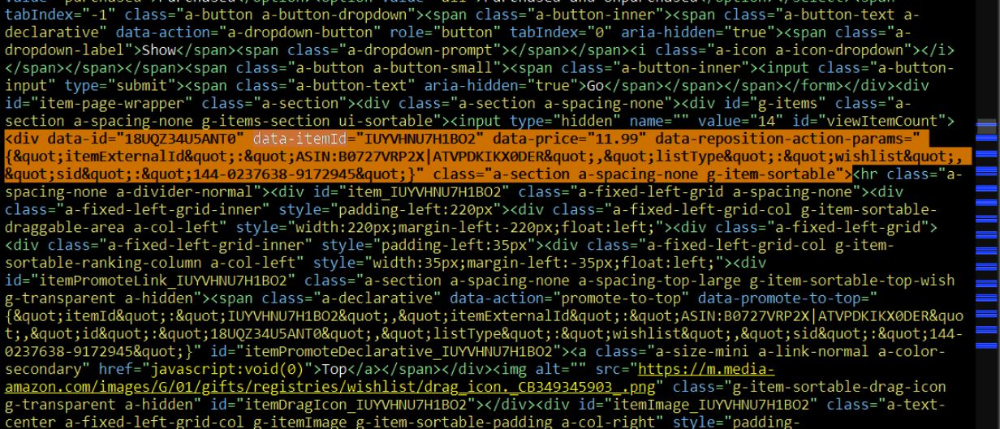

HTML code containing availbility info
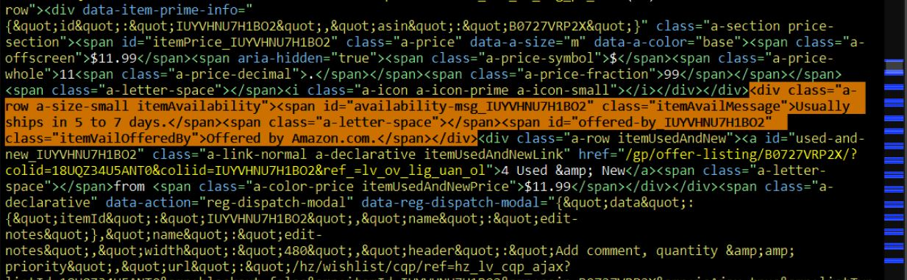

HTML code containing web address and product name
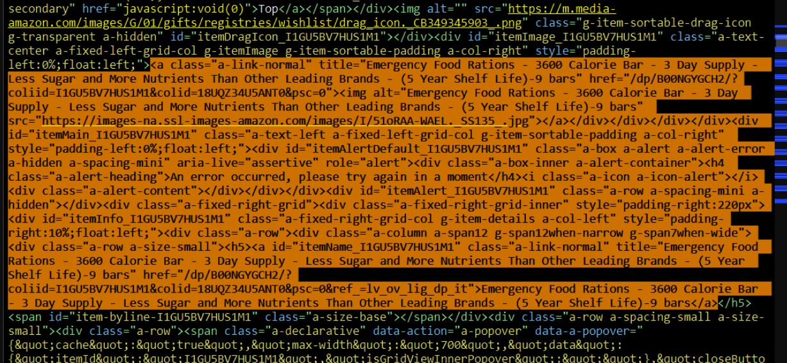

## Section 2. Extracting HTML Data Using Product ID

### Setting Up Libraries

```python
# setup libraries
# pip is a package management system
import pip
pip.main(["install", "bs4"])
# beautifulsoup parses HTML
from bs4 import BeautifulSoup
pip.main(["install", "requests"])
# requests, in this case, helps us get HTML from URL
import requests
```

### Find URL of page to-be-scraped

Decide which wishlist you want to web-scrape. It must be a public wishlists on Amazon. 
```python
amz = 'https://www.amazon.com/hz/wishlist/ls/1RK0IP7F6BGMR?&sort=default'
```

### Getting and Parsing HTML Data

```python
# load html data & returns "Scraping complete" if it is
page = requests.get(amz)
stat = page.status_code
if str(stat)[0] == "2":
  ## if 200 or starts with 2, then it has completed
  print("Scraping Complete.")
else:
  print("Error...")
```
```python
# Parse the html and store it in Beautiful Soup format
soup = BeautifulSoup(page.content, 'html.parser')
# Look at the nested structure of the html page
print(soup.prettify())
```
You will get something that looks like the following:
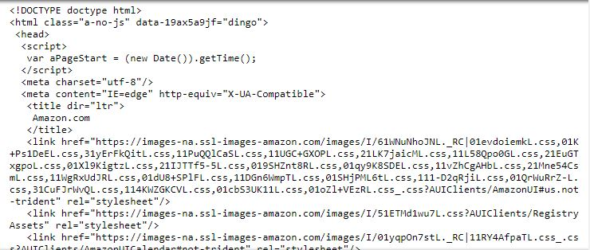

### Extracting Each Product's HTML Section, using Product ID (data-itemid)

```python
# Extracting product's HTML section using product ID
all_items = soup.find_all('div', class_="a-section a-spacing-none g-item-sortable")
## all_items is a "bs4.element.ResultSet", with each index pertaining to a different product
## by converting each index in all_item into a list --> list(all_items[0]), you can extract relevant info
### DO NOT convert all_items into a list, it will be too messy
all_items[0]
```
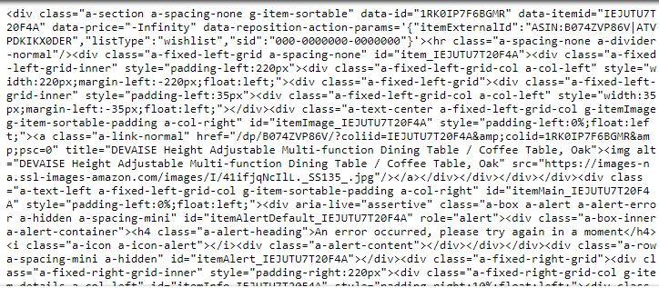

# 3. Organizing Data Using Vectors, Polishing Data

```python
# Initializing lists to be contained with data
inv = []
names = []
prodid = []
website = []

# TRANSFERRING RELEVANT INFO INTO VECTORS

for i in range(0,len(all_items)):
    ##################################
    ########## PRODUCT ID ############
    # List for first product's info
    productzero = list(all_items[i])
    ## productzero contain 2 elements, with the second element containing the bulk.
    productzero = str(productzero[1])
    ## Converting element into string, before indexing
    # Searching for index positions of Product ID number
    start = productzero.index("item_") + 5
    ## +5 , .index("item_") returns the index position of the first character "i"
    end = productzero.index(">") - 1
    ## Rmb: Python indexing includes first index, stops at 2nd index, exclusive
    # Product ID
    #print("Product ID %s: " %i, productzero[start:end])
    prodid.append(productzero[start:end])
    ##################################
    ########## INVENTORY ########## 
    ## Note: Requires the start and end values of PRODUCT ID section
    productinv = all_items[i].find_all("span", id="availability-msg_%s" %(productzero[start:end]))
    productinv = str(productinv)
    #################################
    #################################
    ###### NOTE: ERROR ##############
    # There was an error with inv, due to the 5th and other items, not containing inv info, so the function stopped running
    if len(productinv) == 2:
        inv.append("Only 0 left in stock--order soon.")
    else:
        start = productinv.index(">") + 1
        end = productinv.index("</span>]")
        inv.append(productinv[start:end])
    ##################################
    ########## WEBSITE ########## 
    # Refining the portion that contains website, for extracting
    productweb = all_items[i].find_all('a', class_="a-link-normal")
    productweb = str(productweb[1])
    # Index position of website
    start = productweb.index("href=\"") + 6
    end = productweb.index(" id=") - 1
    website.append("www.amazon.com"+productweb[start:end])
    ##################################
    ########## NAME ########## 
    productname = all_items[i].get_text()
    start = productname.index("moment") + 6
    end = start + 35
    names.append(productname[start:end])
  ```
  
```python
# Inventory Data
print(inv)
```
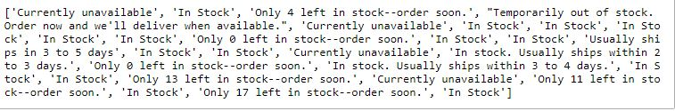

```python
# Product Names
print(names)
```
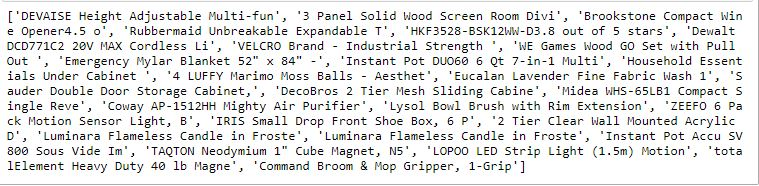


```python
# Product Websites
print(website)
```
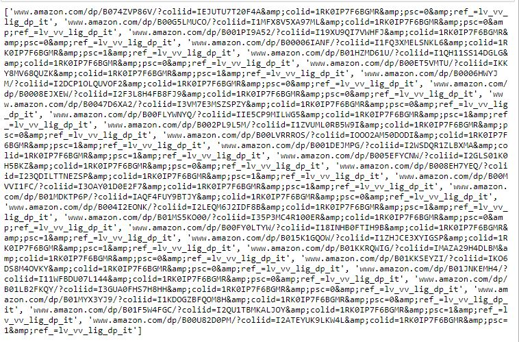

```python
# Product ID
print(prodid)
```
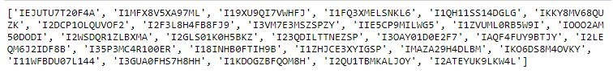

# Section 4. Inputting into Excel

```python
# Inputting ALL info into Excel

import pandas as pd
from pandas import ExcelWriter
from pandas import ExcelFile
import numpy as np
 
df = pd.DataFrame({'ID':prodid,
                   'Inv':inv,
                   'Name':names,
                   'Link':website})
 
writer = ExcelWriter('Amazon Inventory Data.xlsx')
df.to_excel(writer,'Sheet1',index=False)
writer.save()

# Functions
## Dataframe -> transform into
## ExcelWriter('workbook') -> creates new workbook named ()
## dataframe.to_excel -> Writes dataframe to (workbook, 'Worksheet name', index=FALSE)
## workbook.save -> saves changes
```

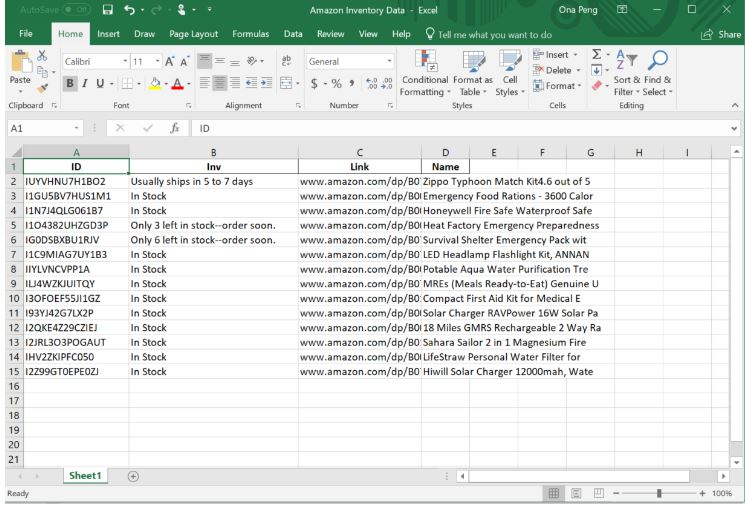

```python
print(inv)
```
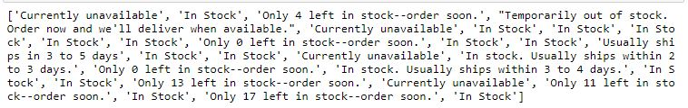

## Low Stock Only Excel Sheet

```python
# Vector containing index positions for low-stock products
lowstockindex = []

for i in range(0,len(inv)):
    if inv[i][0:4] == "Only":
        lowstockindex.append(i)
        
lowstockindex
```
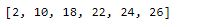

```python
# Low Stock Dataframe and Excel Input
lowprodid = []
lowinv = []
lownames = []
lowlink = []

for i in range(0,len(lowstockindex)):
    lowprodid.append(prodid[lowstockindex[i]])
    lowinv.append(inv[lowstockindex[i]])
    lownames.append(names[lowstockindex[i]])
    lowlink.append(website[lowstockindex[i]])
```
```python
# Writing To Excel
dflow = pd.DataFrame({'ID':lowprodid,
                   'Inv':lowinv,
                   'Name':lownames,
                   'Link':lowlink})
 
writer2 = ExcelWriter('Amazon Low Stock.xlsx')
dflow.to_excel(writer2,'Sheet1',index=False)
writer2.save()
```
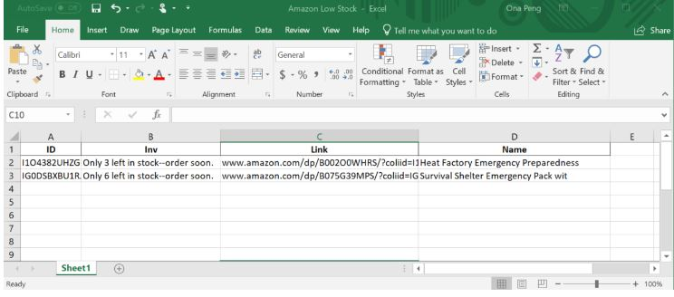
