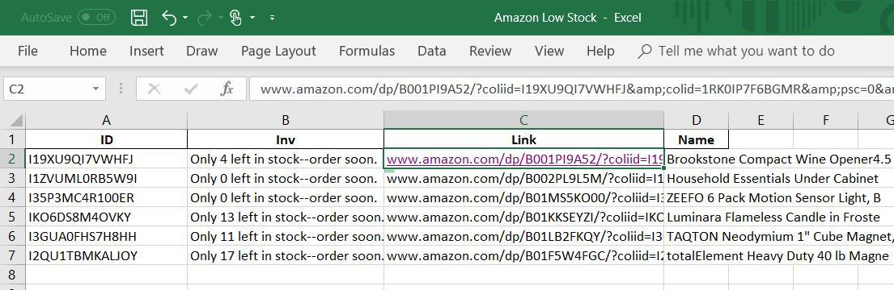

## Monitor Your Amazon Competitors' Inventory

### Objective

This script will create a spreadsheet of the competiting products that are currently "Out Of Stock" or low in stock, like shown below.



### Why is this useful? 

1. This could be an opportunity to push out competitors. When a product goes out of stock, Amazon drops their search ranking. 
2. Knowing when your competitors are/will be out of stock can help you make better informed restocking and pricing decisions. 

### Requirements

For this script to work, you must add your competitors' products to your Amazon wishlist. It can be any wishlist, just make sure you set it to "public". This script is unable to web-scrape private wishlists and Amazon searches. 

----------------------------------

### UPDATE 10/26/2018 -------

Amazon has changed the wishlist formatting, so that the inventory data does not show. As a result, this script can no longer return inventory data.

It is possible to adapt the script to return other pieces of information available through the wishlist page. 

---------------------------------


## Welcome to GitHub Pages

You can use the [editor on GitHub](https://github.com/infj-octo/Amazon-Competitor-Inventory-Tracker/edit/master/README.md) to maintain and preview the content for your website in Markdown files.

Whenever you commit to this repository, GitHub Pages will run [Jekyll](https://jekyllrb.com/) to rebuild the pages in your site, from the content in your Markdown files.

### Markdown

Markdown is a lightweight and easy-to-use syntax for styling your writing. It includes conventions for

```markdown
Syntax highlighted code block

# Header 1
## Header 2
### Header 3

- Bulleted
- List

1. Numbered
2. List

**Bold** and _Italic_ and `Code` text

[Link](url) and 
```

For more details see [GitHub Flavored Markdown](https://guides.github.com/features/mastering-markdown/).

### Jekyll Themes

Your Pages site will use the layout and styles from the Jekyll theme you have selected in your [repository settings](https://github.com/infj-octo/Amazon-Competitor-Inventory-Tracker/settings). The name of this theme is saved in the Jekyll `_config.yml` configuration file.

### Support or Contact

Having trouble with Pages? Check out our [documentation](https://help.github.com/categories/github-pages-basics/) or [contact support](https://github.com/contact) and we’ll help you sort it out.
